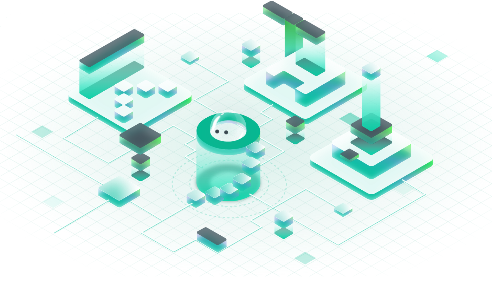

# What is Tako?

Tako Protocol is a modular social protocol, it's inclusive, open, composable, dedicated to providing open and permissionless infrastructure for the decentralized social networks and the creator economy.

Tako Protocol will integrate data from various social platforms such as Farcaster, Twitter, and more, offering developers a convenient, unified development experience. It's like building with Lego blocks; we call it Social Lego. The flexible  APIs, SDKs, and various application development cases enable developers to participate in the construction of decentralized social networks and the creator economy with low entry barriers and high efficiency

<figure><figcaption>
Social Legos
</figcaption></figure>

<figure><figcaption>
Creator Economy
</figcaption></figure>

